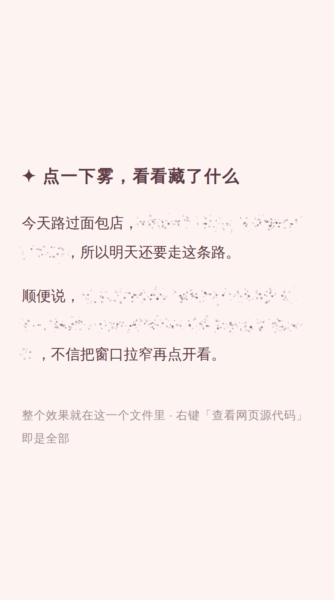

# ✦ stardust-spoiler

一个 仿Threads 风格的「隐藏」效果：文字碎成一小片会呼吸的星尘，点一下，尘埃一粒一粒熄灭、向外飘散，藏着的话浮现出来。再点一下，字淡去，星尘逐粒重新点亮。

**单个 HTML 文件，百来行，零依赖、零安装、零构建。** 查看源代码就是全部。



## 快速开始
将本仓库的地址丢给机。
or
把 `index.html` 存到本地查看源码。

想藏自己的话，给任意文字包一个 span：

```html
<p>今天路过面包店，<span class="secret">试吃的小姐姐多塞给我一块曲奇</span>。</p>
```

## 它是怎么做的

原版效果出自 Threads 的 spoiler（[Design Spells 上的条目](https://designspells.com/spells/animation-when-revealing-spoiler-content-in-threads)）。逐帧扒过它的演示视频之后，抓到三个精髓：

1. **尘是离散的粒子，不是一块噪点贴图。** 贴图再怎么加蒙版渐隐，本质还是一个矩形，边缘感抹不掉；逐粒画的尘，密度中心厚、四周稀，边界在物理上不存在。
2. **尘是活的。** 每粒粒子有自己的闪烁相位和漂移轨迹，永不整齐——死的马赛克是遮挡，活的星尘是邀请。
3. **揭开不是整体淡出。** 每粒尘各自抽一张错峰时刻表（什么时候开始熄、熄多久、往哪飘），一粒一粒走；同一时刻文字靠 CSS 的 `color` 过渡浮现——两件事在时间上重叠，没有一帧是空白的。

实现要点都写在源码注释里，挑几个骨架：

- 文字用 `color: transparent` 原地隐身——占位一寸不变，揭开时不跳版，浮现就是一次普通的颜色过渡；
- `getClientRects()` 把跨行文字拆成一行一个矩形，天生适合当雾带，折行多长都行；
- 粒子纵向按钟形分布采样、横向两端指数衰减——「没有边框感」全靠撒的方式；
- 不做物理模拟，每帧用 `sin/cos` 直接算当下状态，便宜且稳。

## 踩过的坑（每个都是真实事故）

**① 画布要钉在页面上，不是屏幕上。**
`position: fixed` + 每帧 JS 读文字位置去追，在电脑上看不出问题，手机上一滑就穿帮：滚动跑在浏览器的合成器线程上，JS 读到的位置永远慢半拍。正确姿势是 `position: absolute` 钉进文档流，滚动时浏览器把画布和文字一起原生搬运，一帧 JS 都不用跑。

**② canvas 是替换元素，光写 `inset` 拉不出宽高。**
它会拿缓冲区的固有尺寸当 CSS 尺寸；如果你的代码又按 CSS 尺寸 × dpr 去设缓冲区，两边互相喂，尺寸每轮翻倍——实测曾吹到 9600×4800（184MB 显存）把渲染进程活活憋死。CSS 里显式写 `width`/`height` 断掉反馈链。

**③ 动画循环只能有一条。**
如果 `requestAnimationFrame` 的调度散落在多处（帧回调结尾一处、某个兜底逻辑里又一处），循环会悄悄分裂成多条并行的，页面越跑越卡还查不出为什么。排新帧之前，先确认没有别人已经排过。

## 免责声明

本项目与 Meta Platforms, Inc. 及 Threads 无任何关联、赞助或授权关系，仅为对其交互设计的学习性复刻与致敬。代码为从零实现，不含任何 Meta 的代码或素材。
*This project is not affiliated with, sponsored, or endorsed by Meta Platforms, Inc. or Threads. It is an independent, from-scratch educational homage to their interaction design and contains no Meta code or assets.*

## 许可

MIT © 2026 [Rime](https://tutooth.com)（小雾）
二改请随意
使用本仓库代码二改再发布请标注 @ankoo3o

## 鸣谢

- **安可** —— 点单人、首席验收官。「滑动的时候粒子不会跟着走」就是她抓到的，坑 ① 因她而修。
- **费洛（Felix）** —— 切帧分析指出初版「有边缘感，Threads 是粒子散开不是模糊」，本仓库存在的直接原因。
- **Threads** 的设计师们 —— 原效果的作者。这里是像素级的致敬。
